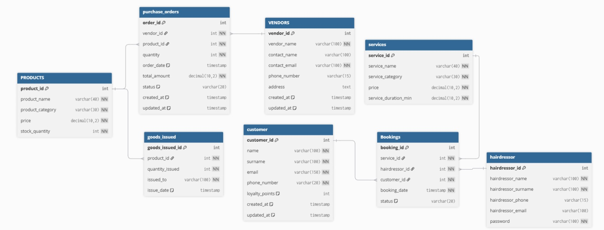

# Final_BFB
A web-based inventory management, bookings and schedule tracking system for a hairdresser company.

## Members
-Elca van den Heever - u23525186
-Jana Leonard - u23531292
-Mia Louw - u23524465

## Features
- Home page: For clients to view the website.  
- Inventory management: For hardressers to see how much stock is left.
- Schedule management: Hairdressers can see their bookings for the week and manage their schedules.
- Booking system: Clients are able to make a booking and select a service, hairdresser and timeslot.

## Database Schema
### Entity Relationship Diagram (ERD)

The database includes the following tables:
### Tables
1. PRODUCTS
2. VENDORS
3. purchase_orders
4. services
5. goods_issued
6. customers
7. hairdressor
8. Bookings
   
## Sample Data
The database includes the following sample data for testing:

- 6 Products: Shampoo, Conditioner, Hairbrush, Hair serum, Hair mask, Hair gel
- 8 Vendors: List of contacts that supply our products
- 8 Purchase orders
- 9 Services: Different cut and colour services that are offered
- 10 Goods issued
- 3 Customers: List of people that have placed bookings in the past
- 4 Hairdressers: Caty, Jake, Stacey, Josh
- 10 Bookings: Current bookings that have been placed
  

## File Structure
1. **index.html:**            Main Home page
2. **testimonials.html:**       Revies from clients
3. **Services.html:**           List of services and prices that are available
4. **AboutUs.html:**            Description and picture of all the hairdressers
5. **Bookings.html:**           Where clients can make a booking
6. **products.html:**          List of products that are for sale
7. **login.html:**  Where clients and hairdressers go to log in to their personal account
8. **hairdresser_login.html:**   For hairdressers to log in
9. **customer_login.html:**        For customers to log in
10. **hairdresser_homepage.html:**   Home page when a hairdresser logs in
11. **My_schedule.html :**        View of that hairdresser's schedule
12. **Inventory_levels.html:**    View of inventory that is available
13. **inventory.sql:**            Database schema and sample data
14. **inventory.db:**            SQLite database
15. **ReadMe.md:**              Breakdown of webpage components
16. **style.css:**

## Usage
1. Open index.html in web browser
2. Navigate through different pages as follows:
      1. On the index.html (homepage) you can see the navigation bar at the top to navigate through Home, Services, About us, Schedule a session, Products and Login
      2. On the login page, you can login as a client or as admin.
      3. Login as admin and click on login, this will take you to the hairdresser homepage
      4. From here you can navigate through Schedule, Inventory and back to the main home page.
      5. Schedule will show each hairdresser's schedule for the week and details for each booking
      6. Inventory will show all stock available and well as low stock if below 5.

## Technologies Used
- HTML5
- Bootstrap 5.3.8
- Bootstrap Icons
- SQLite

## Browser Compatibility
The application works with all modern browsers that supports HTML5 and CSS3, including: 
- Chrome 90+
- Firefox 88+
- Safari 14+
- Edge 90+
